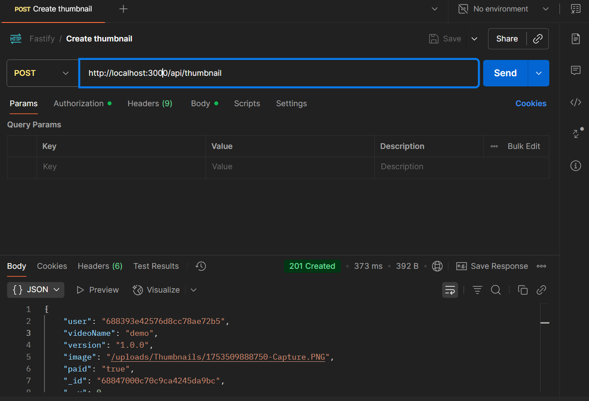
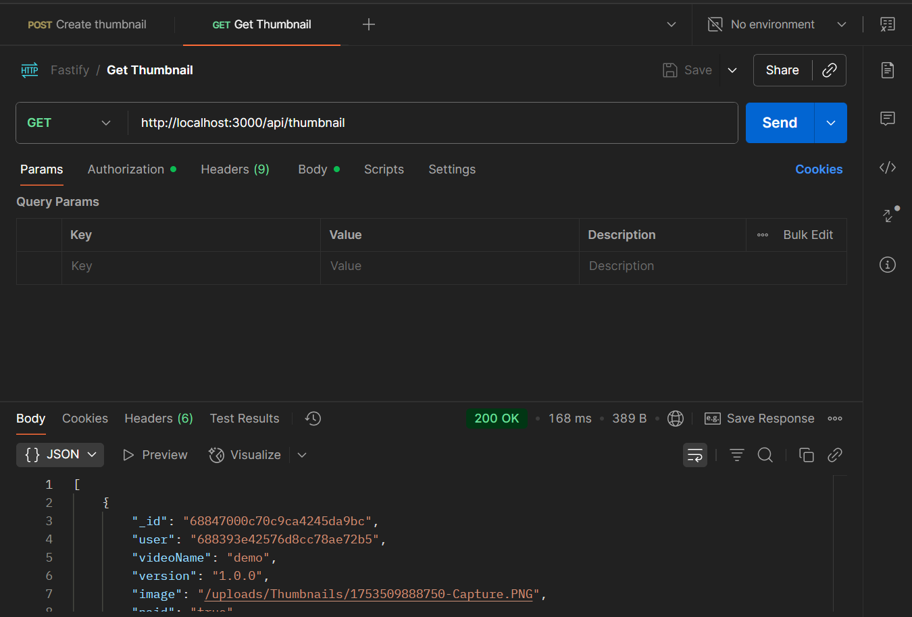

# Fastify Thumbnail & Auth API

A RESTful API built with **Fastify** for user authentication and thumbnail management.  
Features secure JWT authentication, password reset, and file upload for video thumbnails.

## Features

- User registration & login (JWT-based)
- Password reset via email token
- Upload, update, delete, and list video thumbnails
- MongoDB for persistent storage
- Secure password hashing with bcryptjs

## Tech Stack

- **Backend:** Node.js, Fastify
- **Database:** MongoDB (via Mongoose)
- **Authentication:** JWT

## Screenshots

### Create Thumbnail (POST)


### Get Thumbnails (GET)


*Screenshots above show API usage in Postman for creating and retrieving thumbnails.*

## Getting Started

### Prerequisites

- Node.js (v14+)
- MongoDB instance (local or Atlas)

### Installation

```bash
git clone https://github.com/yourusername/fastify-thumbnail-auth-api.git
cd fastify-thumbnail-auth-api
npm install
```

### Environment Variables

Create a `.env` file in the root directory:

```
PORT=3000
MONGODB_URI=your_mongodb_connection_string
JWT_SECRET=your_jwt_secret
```

### Running the Server

```bash
npm run dev
```

Server will run at `http://localhost:3000`.

## API Endpoints

### Auth

- `POST /api/auth/register` — Register a new user
- `POST /api/auth/login` — Login and receive JWT
- `POST /api/auth/forgot-password` — Request password reset
- `POST /api/auth/reset-password/:token` — Reset password

### Thumbnails (Protected)

- `POST /api/thumbnail/` — Upload a thumbnail (multipart/form-data)
- `GET /api/thumbnail/` — List all thumbnails for user
- `GET /api/thumbnail/:id` — Get a single thumbnail
- `PUT /api/thumbnail/:id` — Update thumbnail metadata
- `DELETE /api/thumbnail/:id` — Delete a thumbnail
- `DELETE /api/thumbnail/` — Delete all thumbnails for user

## Folder Structure

```
controllers/
models/
routes/
uploads/
.env
server.js
```

## Testing

API endpoints can be tested using [Postman](https://www.postman.com/).  
A ready-to-use Postman collection is provided in the `tests/Fastify.postman_collection.json` file.  
- Import this collection into Postman to test all authentication and thumbnail routes.
- Example requests and responses are shown in the Screenshots section above.


